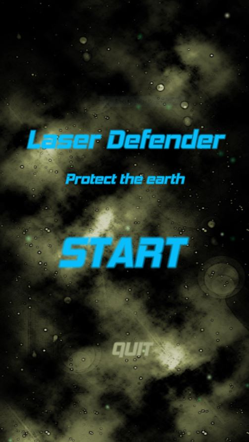
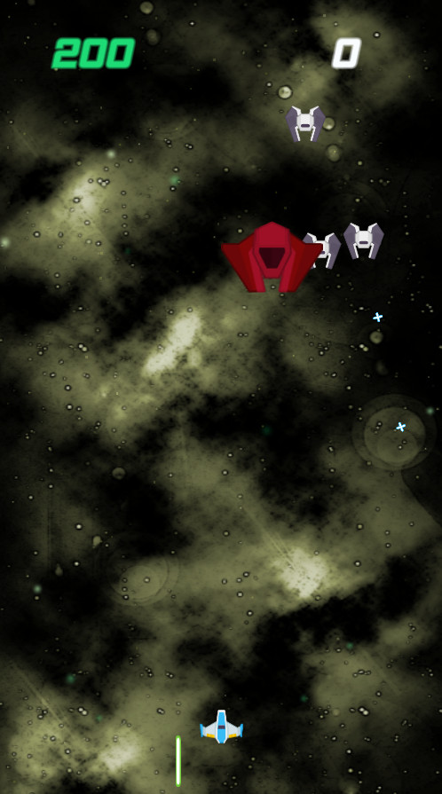
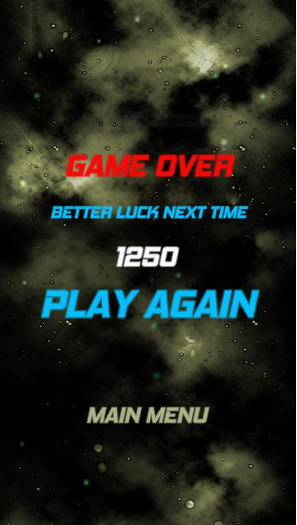

# UC001-05-LaserDefender

Development Platform: 
+ Win 10
+ Unity Version: 2018.2.14f
+ Visual Studio Version: 15.9

Resourses for this game: 
+ Music: https://opengameart.org Author: SketchyLogic, https://opengameart.org/content/nes-shooter-music-5-tracks-3-jingles
+ Sound: https://kenney.nl/assets?q=audio
+ Visuals: https://kenney.nl/assets?s=space+shooter

other Links: https://freesound.org/

This 2D shooter game was implemented along the Laser Defender Session (7h.40min) 
from the Undemy course "Complete Unity 2D Course" by Ben Tristem and Rick Davidson.

During working on this project it was necessary to upgrade Visual Studio from 15.4.5 
up to 15.9 because it was not possible to access TextMeshPro components via scripts (using TMPro was not recognized).

ToDo: setup Anchors, now it is not possible to play the game in webgl.

Further Work:
+ Limit the player's shots, reloading takes time (sounds for reloading, passing time)
+ Rotation of enemies, some shoot from the bottom
+ Energy for for the player, the player collect something to recover energy
